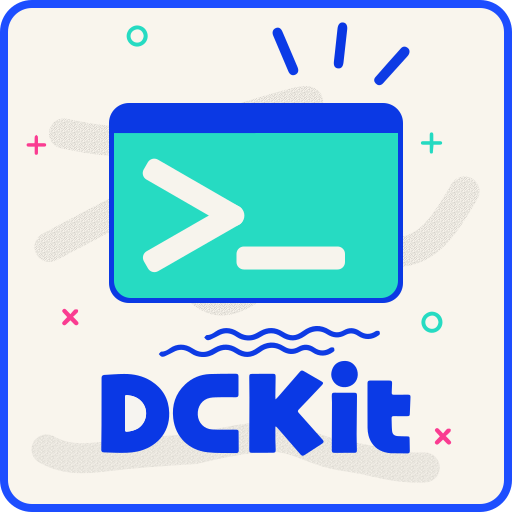

<div align="center">



<h1>DCKit</h1>

<p><strong>A modular developer console framework for Godot 4</strong></p>

[](https://godotengine.org)
[](LICENSE)
[]()

---

```
> player.warp Vector3(12, 0, 8)   ↵
✓ warped to (12, 0, 8) in 0.3 ms
```

</div>

---

DCKit gives Godot 4 projects a full-featured in-game developer console — from the parser that reads what you type, to the syntax-highlighted input field that shows it, to the command pipeline that runs it.

Everything is modular. Drop in the commands you need, skip the ones you don't, and extend without touching the core.

## Installation

1. Copy the `dckit/` folder into your project's `addons` directory.

   **Example:**

   ```
   res://addons/dckit/
   ```

2. Open **Project → Project Settings → Plugins**.

3. Locate **DCKit** in the plugin list and click **Enable**.

4. Once enabled, the addon automatically registers the **`DCKit`** autoload singleton, making it available throughout your project.

## Basic Usage

DCKit runs as an autoload singleton. Once added to by enabling the addon in **Project Settings → Plugins**, it wires up the registry, variable store, analyzer, and executor for you, and (in debug builds, or if enabled for release via project settings) spawns the console UI automatically.

### Opening and closing the console

```gdscript
DCKit.toggle_console()   # e.g. bound to a key like `~` or F1
DCKit.show_console()
DCKit.hide_console()
DCKit.is_console_open()  # bool
```

Connect to `console_opened` / `console_closed` if game code needs to react — e.g. pausing input or the game itself while the console is up:

```gdscript
DCKit.console_opened.connect(func(): get_tree().paused = true)
DCKit.console_closed.connect(func(): get_tree().paused = false)
```

### Toggling from an `_input()` handler

The demo project binds the console to the backtick key like this:

```gdscript
func _input(event: InputEvent) -> void:
    if event is InputEventKey and event.pressed and event.keycode == KEY_QUOTELEFT:
        DCKit.toggle_console()
        if DCKit.is_console_open():
            pause.process_mode = Node.PROCESS_MODE_DISABLED
        else:
            pause.process_mode = Node.PROCESS_MODE_INHERIT
        get_viewport().set_input_as_handled()
```

> ⚠️ **Note — this is demo code, not a prescribed pattern.**
> It's included in the sample project to show one way to wire up a toggle key, but it has a few sharp edges worth knowing before you copy it as-is:
>
> - It assumes a sibling/parent node called `pause` exists and that toggling its `process_mode` is how _your_ game pauses — DCKit itself has no opinion on pausing and does not pause anything automatically when the console opens.
> - Setting `process_mode` to `PROCESS_MODE_INHERIT` on close assumes the pause node's parent isn't itself paused; if it is, this can silently un-pause things you didn't intend to.
> - `KEY_QUOTELEFT` is hard-coded rather than read from an `InputMap` action — remap-friendly projects should define a `toggle_console` action instead and check `event.is_action_pressed("toggle_console")`.
> - Because DCKit's own UI (`_ui`) already consumes input while focused, make sure this handler runs at a point in the input flow where it won't fight with the console's internal input handling — `get_viewport().set_input_as_handled()` here is doing that job, but only for this one event.
>
> Treat this snippet as a starting point for your own input/pause integration, not a drop-in requirement.

### Registering a command

```gdscript
DCKit.register(
    "player.heal",
    func(ctx: DCContext) -> DCResult:
        var amount = await ctx.arg(0)
        player.heal(amount.as_float())
        return DCResult.ok("healed %s" % amount),
    "Heals the player by the given amount.",
    [DCDefinition.Param.new("amount").describe("HP to restore.")]
)
```

Prefer building a full `DCDefinition` up front (e.g. with aliases or deprecation)? Use `register_def()` instead:

```gdscript
DCKit.register_def(
    DCDefinition.new("player.heal", _on_heal, "Heals the player.")
        .alias("heal")
)
```

`unregister()`, `lock_command()`, and `unlock_command()` manage a command's lifetime the same way you'd expect.

### Running a command from code

Useful for cheats menus, test harnesses, or triggering console commands from gameplay events:

```gdscript
var result := await DCKit.run("player.warp Vector3(0, 5, 0)")
if not result.success:
    push_warning(result.message)
```

### Reading and writing variables

The console's variable store is also available directly to game code — handy for sharing state between typed commands and scripts:

```gdscript
DCKit.set_var("difficulty", "hard")
var difficulty := DCKit.get_var("difficulty", "normal")  # fallback if unset
DCKit.has_var("difficulty")     # true
DCKit.delete_var("difficulty")
DCKit.get_var_keys()            # Array of all variable names
```

## Syntax

A command is a name followed by zero or more arguments:

```
echo "done" ;
```

**Arguments** can be any of:

| Form                   | Example                                                                                                  | Meaning                                                        |
| ---------------------- | -------------------------------------------------------------------------------------------------------- | -------------------------------------------------------------- |
| Bare word / number     | `12`, `foo`                                                                                              | Unquoted literal                                               |
| Quoted string          | `"hello world"`, `"it's fine"`, `` `raw` ``                                                              | Literal with escapes (`\n`, `\t`, `\"`, `\\`, ...)             |
| Variable               | `$speed`                                                                                                 | Fails if `speed` is undefined                                  |
| Variable (explicit)    | `$speed!`                                                                                                | Same as above — fails if `speed` is undefined                  |
| Silent variable        | `$speed?`                                                                                                | Resolves to `""` if undefined                                  |
| Variable with fallback | `$speed:5`, `$pos:(player.get_position)`                                                                 | Falls back to a literal, another variable, or a nested command |
| Braced variable        | `${speed}`, `${speed!}`, `${speed?}`, `${speed:5}`, `${name:$other}`, `${ pos : (player.get_position) }` | Same as above, but tolerant of surrounding whitespace          |
| Constructor            | `Vector3(1, 2, 3)`, `Color(1, 0, 0, 1)`                                                                  | Built-in or custom typed value                                 |
| Nested command         | `(var.get score 0)`                                                                                      | Runs a sub-command and uses its result as the argument         |

The modifier always trails the variable name — never precedes it — and only one may be used at a time:

- **(none)** or **`!`** — required; the command fails if the variable is undefined.
- **`?`** — silent; resolves to `""` if undefined, no error.
- **`:fallback`** — resolves to `fallback` if undefined. `fallback` can itself be a literal, another variable (`$a:$b`), or a nested command (`$a:(cmd)`), and fallback chains resolve recursively (`$a:$b:"final"`).

**Constructors** can nest arbitrarily and take variables or nested commands as parts:

```
player.warp Vector3($x, 0, $z:8)
```

**Comments** — everything after `#` on a line is ignored:

```
player.warp 0 0 0   # reset to origin
```

**Note**: command chains (`;`) are **not** allowed inside a fallback's nested command — `$pos:(cmd1; cmd2)` will raise a lex error.

## Additional Information

Please explore the exposed classes and the demo project to learn how to use the addon.

If you encounter any issues, have questions, or have suggestions for improvements, feel free to open an issue on GitHub.

This addon is still being tested, so feedback from real-world projects is greatly appreciated.

---

<div align="center">
<sub>Built for Godot 4 · GDScript · MIT License</sub>
</div>
